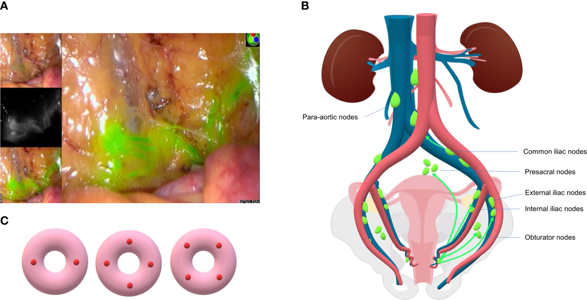

# Introduction

### Uterine and endometrial cancer has been increasing worldwide, with an incidence rate of 27.8% and 7.7%, respectively (American Cancer Society, 2022). Due to cancer symptoms becoming more present during later stages of cancer, it is difficult to detect and diagnose patients simply through screening. Many forms of endometrial cancer are stage IV, demonstrated by spreading to lymph nodes in the abdomen, alongside the pelvis and para-ortic area regions of a woman’s body. 
### Through efforts and attempts to improve detection, diagnoses, prevention, and surveillance of uterine cancer among patients, researchers and clinicians are examining the lymph node status through sentinel lymph node excision (SLN) and ultrastaging. Sentinel lymph node exision is the process in which a sentinel lymph node is identified, removed, and examined to determine whether cancer cells are present. Ultrastaging involves additional sectioning and staining of the SLN in order to examine for low-volume metastatic disease.
### Researchers can detect potential metastatic endometrial and uterine tumors through this new health technological development, and avoid collecting data by resorting to unnecessary complete pelvic and para-aortic lymphadenectomies (Kang, 2020). 
### This dataset describes the pathological features discovered of endometrial and uterine carcinomas and their association with sentinel lymph node involvement (Kang, 2020). This markdown aims to depict and analyze the discovered stratified pathological features of endometrial and uterine carcinomas, and their association with sentinel lymph node excisions present among women. Specifically, we are measuring the detection of tumors present in lymph nodes, through the usage of SNL exision and ultrastaging.


```{r setup, include=FALSE}
knitr::opts_chunk$set(echo = FALSE, warning = FALSE, message = FALSE)
```

```{r, load-data, echo=FALSE}
#load Harvard Dataset
here::i_am("SLN_Final.Rmd")
#stick with Age, Size of Tumor, and Lymph node Location for now
```
<br>
<br>


Figure 1.) Lymph drainage of the uteri is complex, bilateral, and can affect lymph nodes in several areas. Nine SNL's were found and localized in the left obturator fossa (three), right obturator fossa (two), left external iliac (one), right external iliac (one), right common iliac (one), and on the junction of the right internal iliac and obturator fossa (one). 

<br>
<br>


<br>
Figure 2.) (A) SLN and lymphatic vessel mapped in surgery using ICG dye and intraoperative fluorescence imaging system.  surgeon injects a radioactive substance, a blue dye, or both near the tumor. The surgeon then uses a device to detect lymph nodes that contain the radioactive substance or looks for lymph nodes that are stained with the blue dye. Once the sentinel lymph node is located, the surgeon makes a small incision in the overlying skin and removes the node. The sentinel node is then checked for the presence of cancer cells by a pathologist.(B) Common lymphatic drainage pathway of endometrial cancer. SLN's are mostly located in external iliac and obturator region and less commonly in presacral and common iliac area. (C) Three patterns of cervical injection sites of SLNM: two sides or four quadrants.
<br>
<br>


<br>
Figure 3.) Schematic representation of the location and frequency of sentinel lymph nodes in Grade 1 endometrial cancer. The proximal obturator nodes and the internal iliac nodes are anatomically difficult to distinguish and frequently overlap.
<br>
<br>
<br>
<br>
```{r message=FALSE, SNL_table, echo=FALSE}
readRDS(file = here::here("output/uterine_table.rds"))
```

<br>

Table 1. There are 8 unique locations of these SLN lymph nodes analyzed. These include pelvic, common iliac, external iliac, inernal iliac, para-aortic, and obturator lymph nodes. The pelvic lymph nodes mainly include the external iliac, internal iliac, and obturator lymph nodes, which are below the bifurcation of the common iliac artery. These SLN lymph node locations indicate that it is a sentinel lymph node in which the cancer reached first. When a specific lymph node is recorded, this indicates detection of uterine/endometrial cancer primarily in that location. The locations of these lymph nodes are also grouped by tumor size, less than 2 mm or greater than 2 mm. 2 mm is considered one standard of detecting if the tumor has spread to lymph nodes or metastasized.

<br>
<br>

```{r message=FALSE, SNL_table_2, echo=FALSE}
readRDS(file = here::here("output/uterine_table_2.rds"))
```
<br>
Table 2. There are primarily three assigned grades for the discovered uterine cancers: Grade I, Grade II, and Grade III. Grade I is defined as cancer cells that are 5% or less of tumour tissue that is solid tumour growth. These are well differentiated, tend to be slow growing, and less likely to spread. Grade II indicates that 6%–50% of tissue is solid tumour growth, and that the cancer cells are moderately differentiated. Grade III is the severest of all, in that more than 50% of tissue is solid tumour growth. These cells are poorly differentiated and are more likely to grow quickly and spread, than Grade I cells. The assigned grades for the affected lymph nodes are also grouped by tumor size, less than 2 mm or greater than 2 mm. 2 mm is considered one standard of detecting if the tumor has spread to lymph nodes or metastasized.


<br>
<br>
```{r message=FALSE, SNL_table_3, echo=FALSE}
readRDS(file = here::here("output/uterine_table_3.rds"))
```

<br>

Table 3. Patient Age details the average age of the patients, along with the lowest to highest age recorded. The patient ages are also grouped by tumor size, less than 2 mm or greater than 2 mm. 2 mm is considered one standard of detecting if the tumor has spread to lymph nodes or metastasized.

<br>
<br>

Graphical Analyses

```{r, plot-1, echo=FALSE}
knitr::include_graphics( here::here("output/scp_db.png") )
```
<br>
Figure 1. This plot compares risk prediction among uterine cancer patients having undergone SLN excision and ultrastaging, comparing high risk (red) and medium risk (purple) cancer patients, classified by decision boundary formula  0 = -5.192761 + 4.728167$x_1$ + 3.662024$x_2$. 

Utilizing classification by decision boundary and feature scaling, we can predict the overall risk of cancer grade status among our uterine cancer patients, given their age and tumor size. Those classified as high risk (red) are located above the decision boundary, and those classified as medium risk (purple) are located below the decision boundary. Both were determined after having undergone SLN excision and ultrastaging, and researchers can priortize which patients need therapy and treatment.

<br>
<br>

```{r, plot-3, echo=FALSE}
knitr::include_graphics( here::here("output/bin_curve.png") )
```

Figure 1. This logistic regression curve predicts the association of the size of the tumor and the risk of cancer grade status, high risk (blue) and medium risk (red). This curve measures this association by method by sentinel lymph node excision and ultrastaging.
<br>
<br>
<br>


<br>
<br>
Thank you so much for teaching this class, David! (I still don't know if I am supposed to call you Dr. Benkeser or not... we'll figure it out lol)
I appreciate how much time, effort, and of course, outtakes, you went through to teach this class (Your past tweets say you don't really like teaching RStudio, I hope we made you reconsider even by 1% haha). I learned so much and developed a genuine appreciation and longing interest for data science coding and related techniques! I have been able to utilize machine learning concepts and clinical logistic regression application in real life projects, and I hope to lead a medical team in the future, so I will continue to build off of what you taught us! Keep making funny jokes, it really helped me laugh (instead of profusely cry and destroy my computer) every time I accidentally added a space in my code (*sigh-I cannot believe Elon Musk and other ridiculous but genius billionaires haven't funded a project to bypass stupid syntax errors). Thank you for everything, and I hope you have a great holiday break with your family!
<br>
<br>

References:
<br>
1.) https://cancer.ca/en/cancer-information/cancer-types/uterine/grading
<br>
2.) https://www.frontiersin.org/articles/10.3389/fonc.2021.701758/full
<br>
3.) https://www.researchgate.net/figure/Lymph-drainage-of-the-cervix-uteri-is-complex-bilateral-and-can-affect-lymph-nodes-in_fig1_46221277
<br>
4.) https://www.ncbi.nlm.nih.gov/pmc/articles/PMC3959736/
<br>
5.) https://www.ncbi.nlm.nih.gov/pmc/articles/PMC7685478/
<br>
6.) https://www.cancer.gov/about-cancer/diagnosis-staging/staging/sentinel-node-biopsy-fact-sheet#what-is-a-sentinel-lymph-node-biopsy
<br>
7.) https://www.rd.com/list/funny-thank-you-memes/